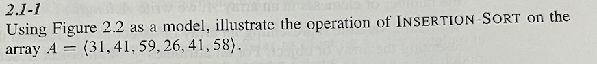
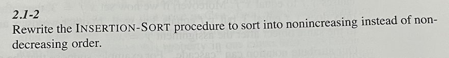

# exercise
### 2.1-1

<h2>Initial state: the original array A=[31, 41, 59, 26, 41, 58]</h2>  

<h3>Iteration 1:</h3>
- Current element: 41.  
- Compare 41 with 31. Since 41>31 no need to swap. 
- Array A after iteration : [31, 41, 59, 26, 41, 58]
<h3>Iteration 2:</h3>
- Current element: 59.  
- Compare 59 with 31 and 41. Since 59>41>31 no need to swap. 
- Array A after iteration : [31, 41, 59, 26, 41, 58]
<h3>Iteration 3:</h3>
- Current element: 26.  
- Compare 26 with 31, 41 and 59.  
- 26 < 59 => swap 26 with 59.  
- 26 < 41 => swap 26 with 41.  
- 26 < 31 => swap 26 with 31.  
- Array A after iteration : [26, 31, 41, 59, 41, 58]
<h3>Iteration 4: </h3>
- Current element: 41.  
- Compare 41 with 59, 41, 31 and 26.  
- 41 < 59 => swap 41 with 59.  
- 41 = 41 => not swap. Stop the compare.  
- Array A after iteration : [26, 31, 41, 41, 59, 58]
<h3>Iteration 5: </h3>
- Current element: 58.  
- Compare 58 with 59, 41, 31 and 26.  
- 58 < 59 => swap 58 with 59.  
- 58 > 41 => not swap. Stop the compare.  
- Array A after iteration : [26, 31, 41, 41, 41, 58, 59]  
<h3>End result: </h3> The sorted array [26, 31, 41, 41, 58, 59] 

### 2.1-2

<h2>Initial state: the original array A=[31, 41, 59, 26, 41, 58]</h2>  

<h3>Iteration 1:</h3>
- Current element: 31.  
- Compare 31 with 41, 59, 26, 41, 58.  
- 31 < 41 => swap 31 with 41.  
- 31 < 59 => swap 31 with 59.  
- 31 > 26 => not swap. Stop the compare.  
- Array A after iteration: [41, 59, 31, 26, 41, 58]
<h3>Iteration 2:</h3>
- Current element: 26.  
- Compare 26 with 41 and 58.  
- 26 < 41<//br> => swap 26 with 41.  
- 26 < 58<//br> => swap 26 with 58.  
- Array A after iteration: [41, 59, 31, 41, 58, 26] 
<h3>Iteration 3:</h3>
- Current element: 41.  
- Compare 41 with 59, 31, 41, 58, 26.  
- 41 < 59<//br> => swap 41 with 59.  
- 41 > 31 => not swap. Stop the iteration.  
- Array A after iteration: [59, 41, 31, 41, 58, 26]
<h3>Iteration 4:</h3>
- Current element: 31.  
- Compare 31 with 41, 58 and 26.  
- 31 < 41 <//br> => swap 31 with 41.  
- 31 < 58 <//br> => swap 31 with 58.  
- 31 > 26 => not swap. Stop the compare.  
- Array A after iteration: [59, 41, 41, 58, 31, 26]
<h3>Iteration 5:</h3>
- Checking element 59. Since 59>41>58>31>26. No swap.  
- Current element: 41.  
- 41 < 58 <//br> => swap 41 with 58.  
- Array A after iteration: [59, 58, 41, 41, 31, 26]
<h3>End result: </h3> The sorted array [59, 58, 41, 41, 31, 26]