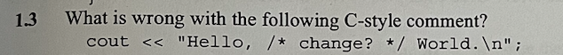
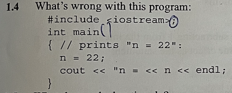
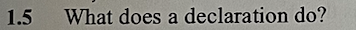
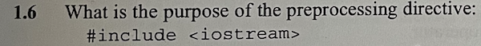
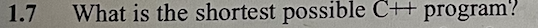
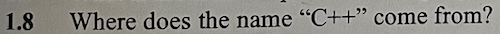
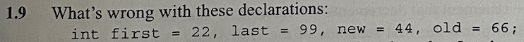

# Review Question:

- cách 1 /* chú thích */  
- cách 2 // chú thích  

- thiếu dấu ; ở hàng int main()  

- câu lệnh này không có sai 
  
- có 4 lỗi sai tất cả :  
    + sau khai báo thư viện không cần ;  
    + sau lệnh main phải có ()  
    + dấu //  dùng để chú thích nên không in ra đc dòng số 3  
    + chư khai báo biến n  

- declaration ( <b>câu lệnh tuyên bố </b>) tác dụng để chương trình dịch thuật ( compiler ) hiểu được biến vừa được khai báo thuộc loại gì và tên gì.

- mục đích của preprocessing directive:  
+ Khai báo các macro: Định nghĩa các đoạn mã con được sử dụng nhiều lần trong chương trình.  
+ Bao gồm các file header: Kết hợp nội dung của các file header khác vào file hiện tại.  
+ Điều kiện biên dịch: Cho phép biên dịch các đoạn mã khác nhau dựa trên các điều kiện nhất định.  

- #include <iostream>  
int main(){}

- Tên C++ là tên kế thừa của chương trình C và dấu " ++ " trong toán học thường được sử dụng để biểu thị phép tăng giá trị của một biến. Ta có thể hiểu đơn giản là C++ là phiên bản hoàn thiện hơn và tối ưu hơn.

- sai chữ new vì new là thì khoá trong bản Appendix B List 62 keyword nên ko sài được.
