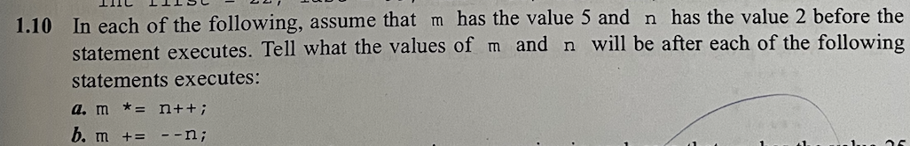
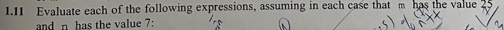
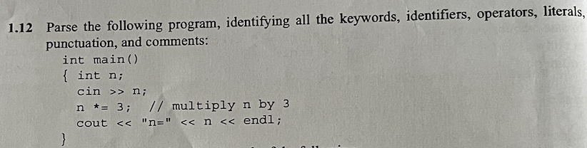
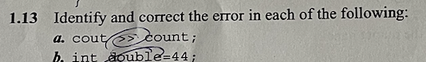
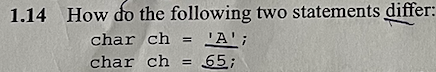

# Review Question:

- cách 1 /* chú thích */  
- cách 2 // chú thích  

- thiếu dấu ; ở hàng int main()  

- câu lệnh này không có sai 
  
- có 4 lỗi sai tất cả :  
    + sau khai báo thư viện không cần ;  
    + sau lệnh main phải có ()  
    + dấu //  dùng để chú thích nên không in ra đc dòng số 3  
    + chư khai báo biến n  

- declaration ( <b>câu lệnh tuyên bố </b>) tác dụng để chương trình dịch thuật ( compiler ) hiểu được biến vừa được khai báo thuộc loại gì và tên gì.

- mục đích của preprocessing directive:  
+ Khai báo các macro: Định nghĩa các đoạn mã con được sử dụng nhiều lần trong chương trình.  
+ Bao gồm các file header: Kết hợp nội dung của các file header khác vào file hiện tại.  
+ Điều kiện biên dịch: Cho phép biên dịch các đoạn mã khác nhau dựa trên các điều kiện nhất định.  

- #include <iostream>  
int main(){}

- Tên C++ là tên kế thừa của chương trình C và dấu " ++ " trong toán học thường được sử dụng để biểu thị phép tăng giá trị của một biến. Ta có thể hiểu đơn giản là C++ là phiên bản hoàn thiện hơn và tối ưu hơn.

- sai chữ new vì new là thì khoá trong bản Appendix B List 62 keyword nên ko sài được.

<b>A</b>. m *= n++
    m có giá trị là 10 và n có giá trị là 3  
<b>B</b>. m += --n
    m có giá trị là 6 và n có giá trị là 1  

<b>A</b>. m - 8 - n ==> 25-8-7=10  
<b>B</b>. m = n = 3 ==> biến m = 3 và biến n = 3  
<b>C</b>. m%n ==> 25%7=4  
<b>D</b>. m%n++ ==> 25%7=4  
<b>E</b>. m%++n ==> giá trị của n là 8 do ++n => 25%8=1  
<b>F</b>. ++m - n-- ==> m có giá trị là 26 và n vẫn giữ nguyên giá trị là 7 => 26-7=19

-keyword: int, main, cin, cout, endl.  
-identifier: n.  
-operators: >>, *=, <<.  
-literals: "n=".  
-punctuations: (), {}, ;.  
-comment:// multiply n by 3  

<b>A</b>. sai chỗ >> vì keyword cout có tác dụng suất ra còn dấu << dùng để nhập dữ liệu từ bên ngoài.  
<b>B</b>. sai chỗ double vì keyword double không được phép làm 1 biến để gáng giá trị.

- cả 2 câu lệnh đều có tác dụng giống nhau đều khởi tại biến ch và khi xuất ra màn hình biến ch sẽ có giá trị là 65

*1.15/
    
