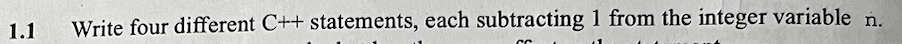
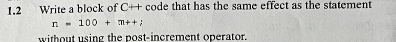
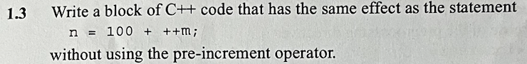
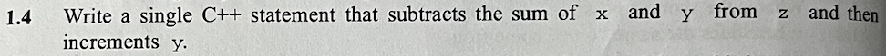
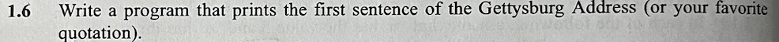
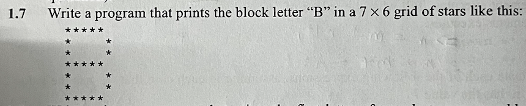
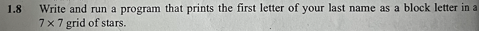
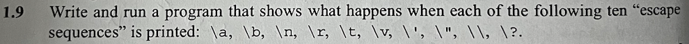
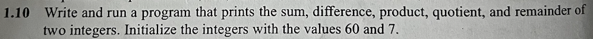

<h1>#problem exercise</h1> 

1/n = n-1  
2/n - = 1  
3/ --n  
4/ n-- 

  
em nghĩ  
  
một ví dụ khác trên mạng 

  

write code

run code

write code

run code

1.11/ 
write code

run code

1.12/  
write code

code run

1.13/  
write code 

run code 

1.14/  
write code

run code
